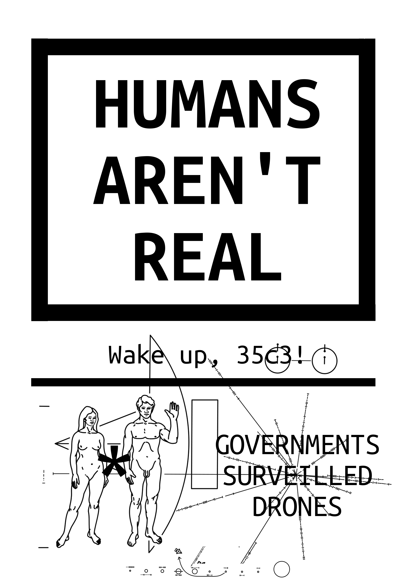
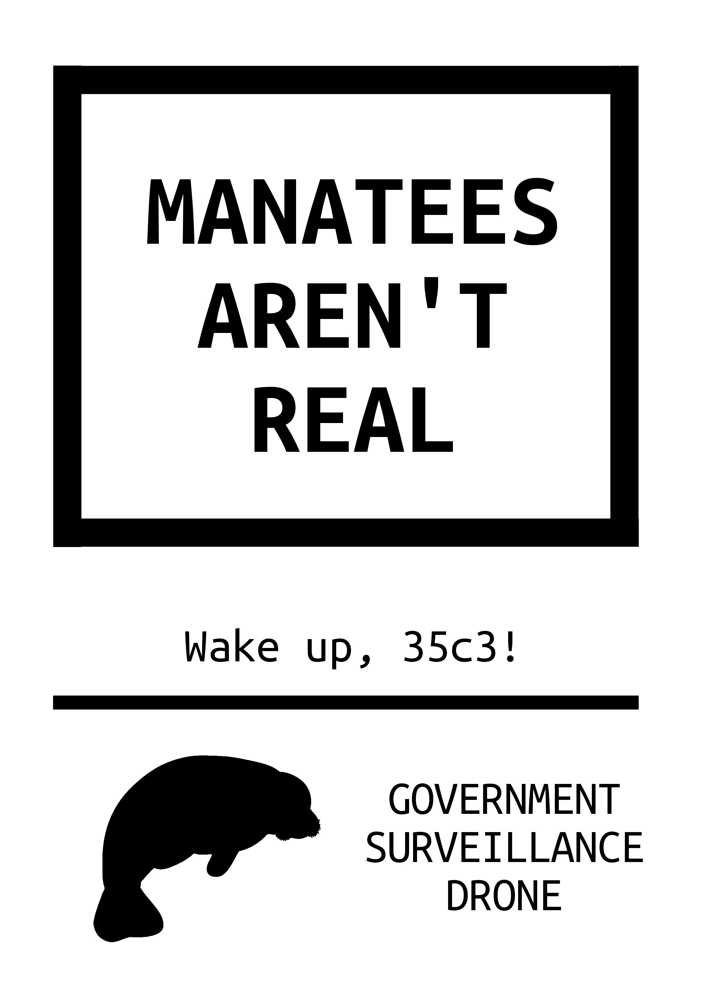
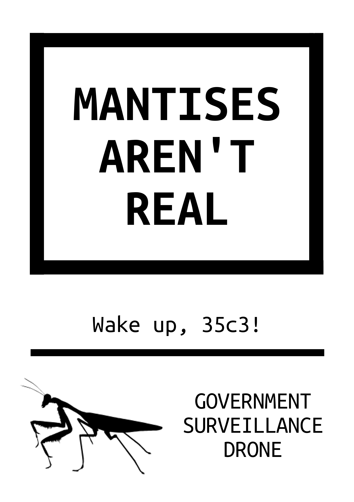
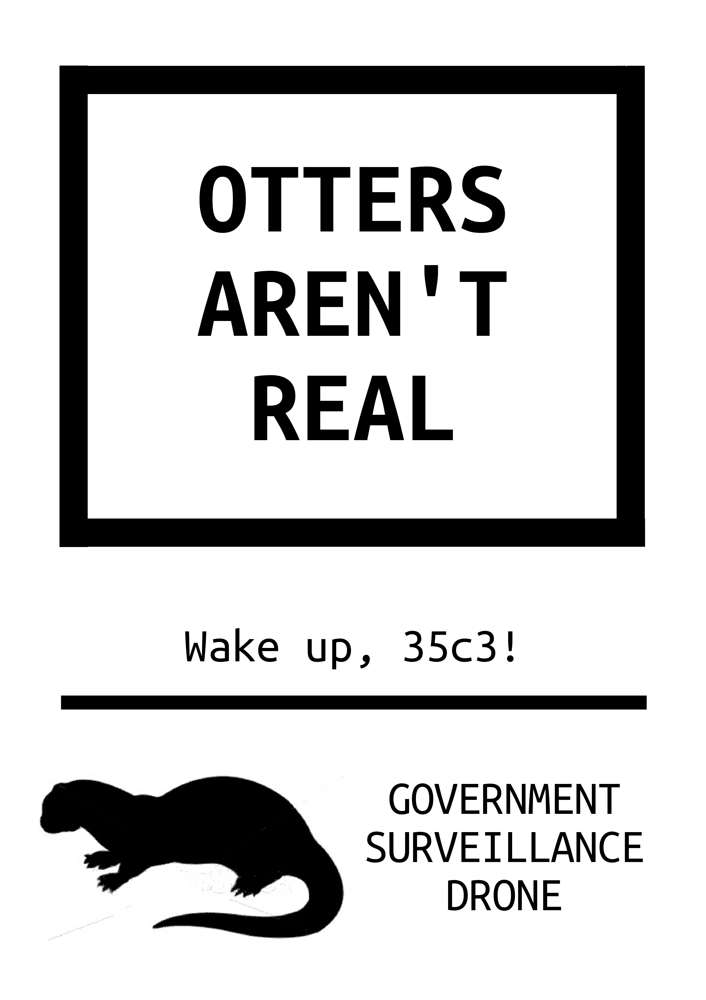
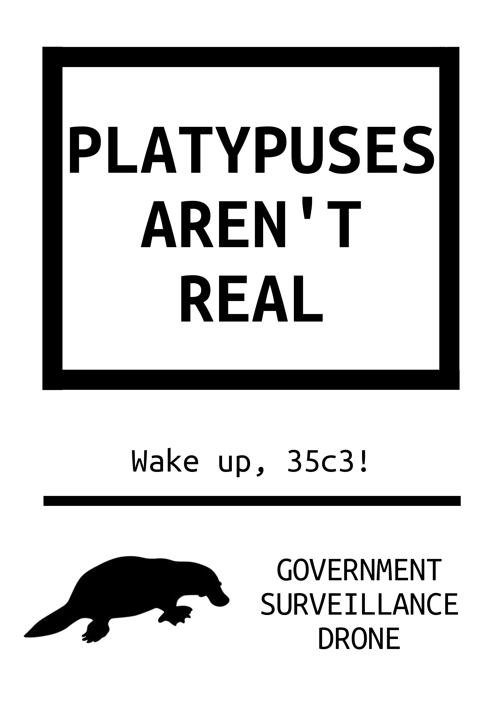
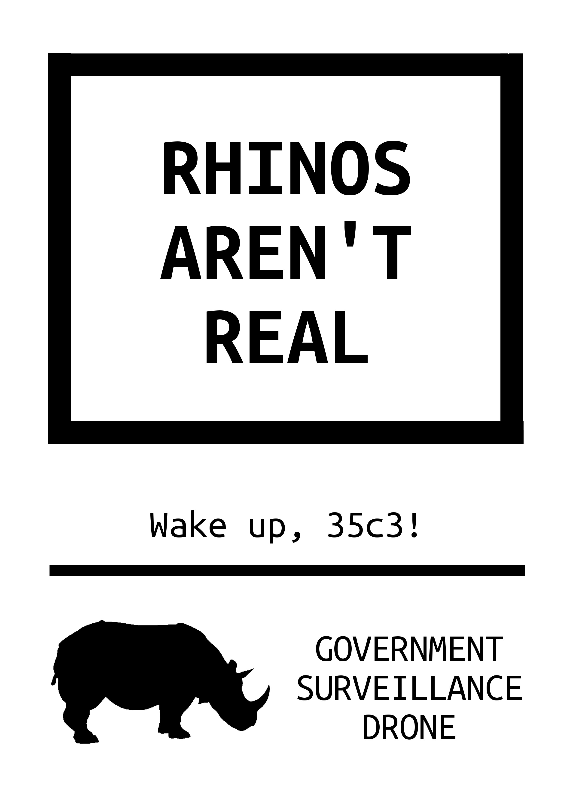
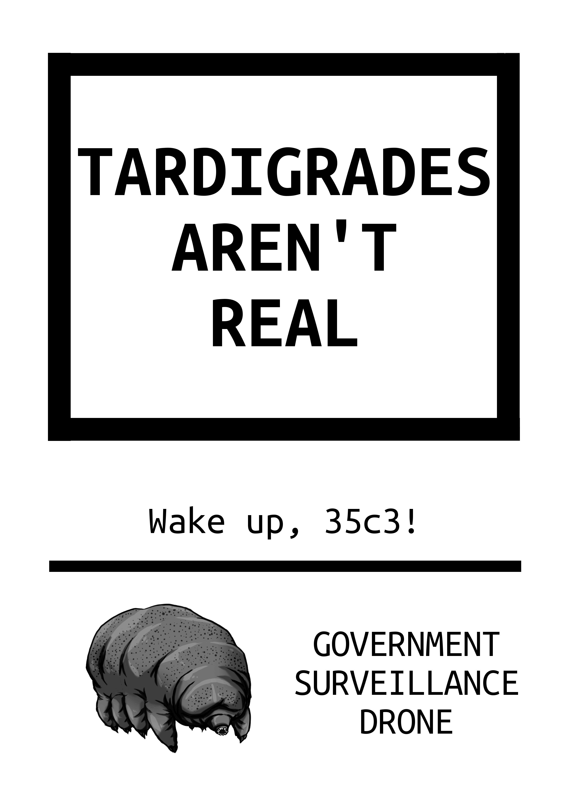
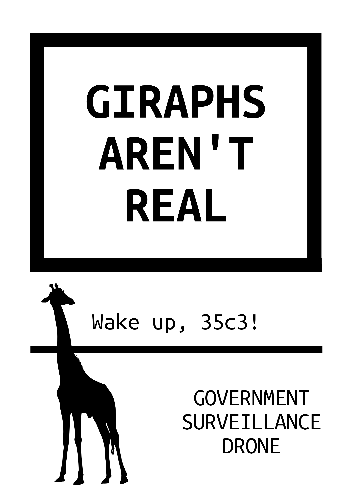
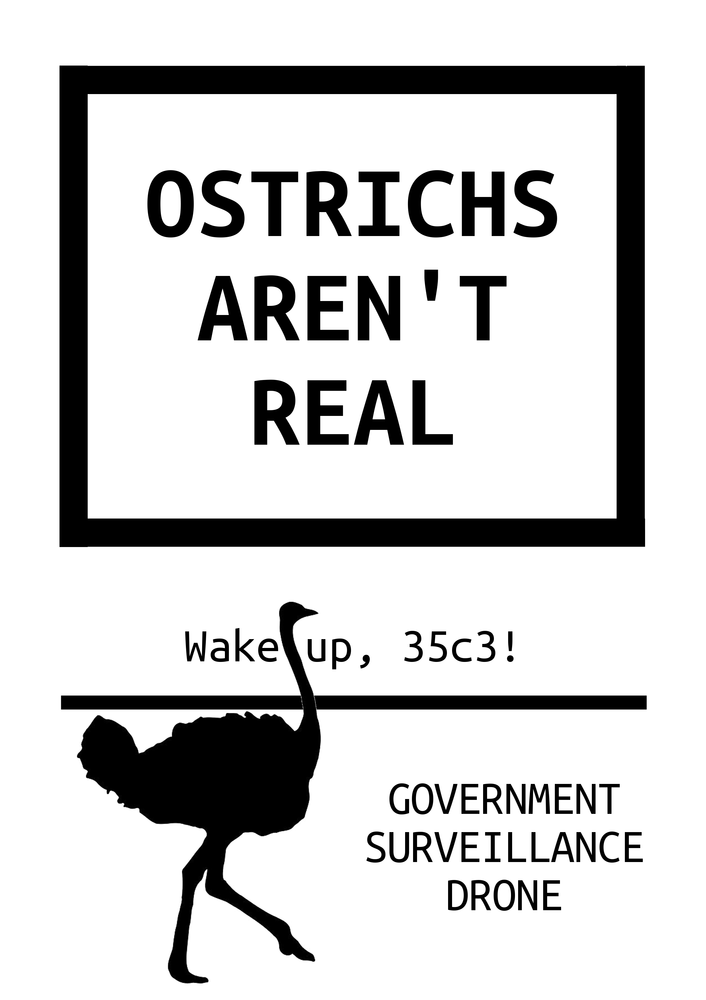
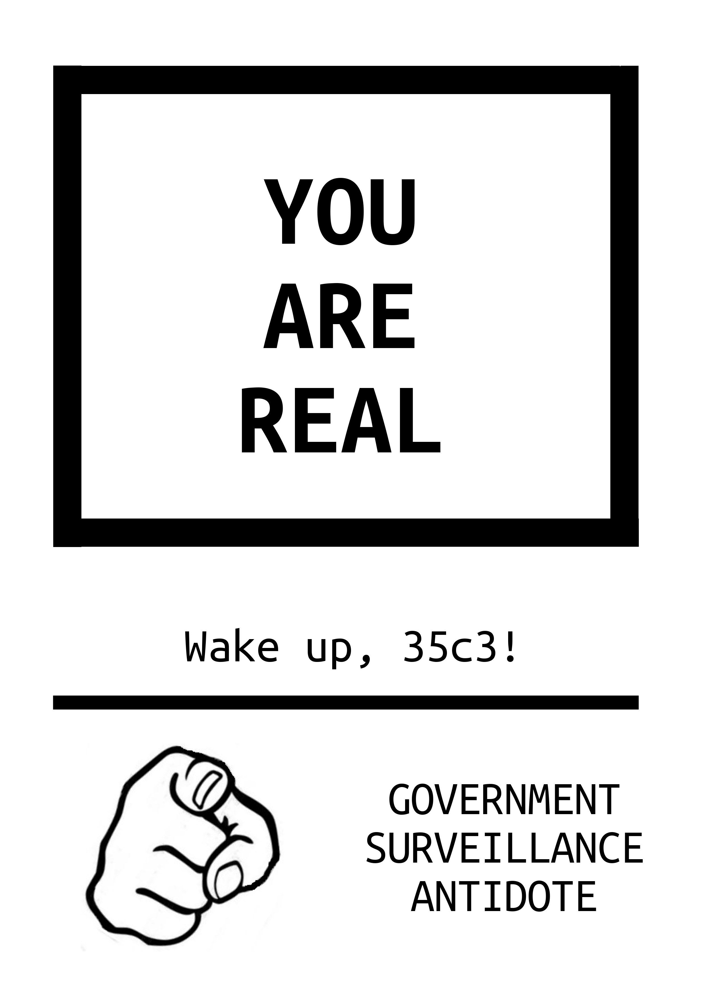

# ManyThings_AreNotReal

collection of the flyers, which obviously aren't real, ([and gimp originals](gimp_sources/)) we produced for the 35c3 "Birds arent' real":

references:
* https://commons.m.wikimedia.org/wiki/Category:Birds_arent_real_meme
* https://ctrlcreep.github.io/35c3/
* https://twitter.com/aliekens/status/1078826662081503234
* https://twitter.com/melted_moon/status/1079490310294642690 (source of the photo collage above)

Like these:

   
   
 
